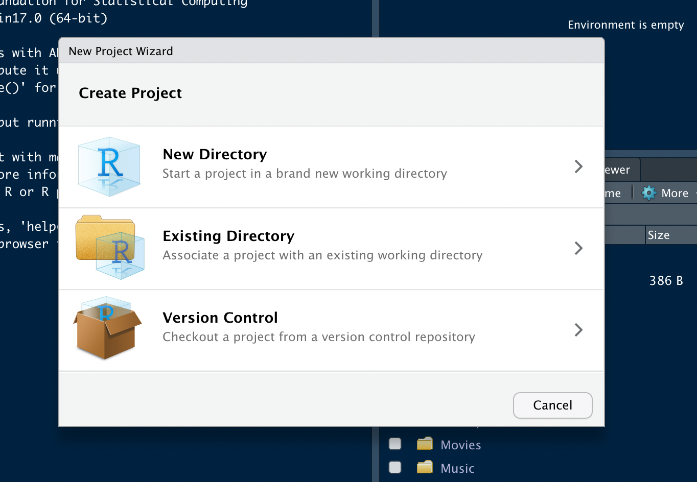
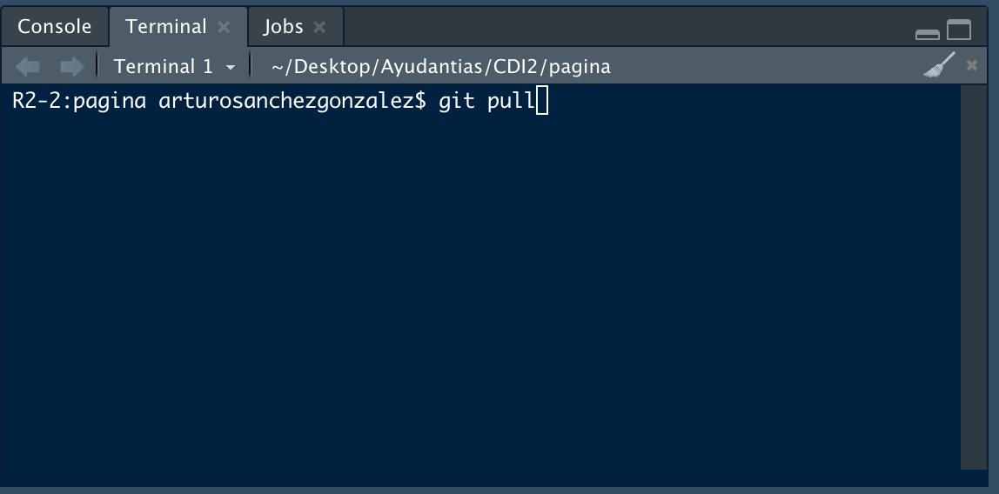

# ¿Cómo trabajar con todo esto?

A continuación daremos las instrucciones necesarias para que todo funcione. La primera parte será establecer las conexiones necesarias para tener un flujo de trabajo adecuado y la segunda será propiamente el flujo en sí.

---

## Creación de una cuenta de Github
Lo primero es crear una cuenta en [GitHub](https://github.com/). Es recomendable elegir un nombre de usuario que luzca profesional.

## Instalación de Git, R y RStudio

Para la parte de instalación de Git en la computadora así como el establecimiento de las conexiones necesarias con Github puede consultar el excelente manual que aparece [aquí](https://cfss.uchicago.edu/setup/what-is-git/). Fue usado en un curso donde no se esperaban fuertes conocimientos previos de programación, por lo cual es muy completo y se puede seguir en orden sin ningún problema. La parte más complicada quizá sea el uso de la consola, pero no es tan diferente del uso habitual que ha hecho con la consola en *R* y *RStudio*. Si procede tal como se indica en el _manual_ mencionado, será capaz de crear y modificar repositorios de Github de manera local. El cómo se hace esto último desde RStudio se explica en la siguiente sección.

**Atención**: En las instrucciones anteriores se ha modificado el método de autenticación puesto que GitHub se ha actualizado para requerir _token_ para autenticarse (vea [aquí](https://cfss.uchicago.edu/setup/git-configure/)). Si tenía el flujo autenticado con contraseña, a partir de Agosto 2021 no podrá actualizar sus repositorios: la recomendación es generar un _token_ (las instrucciones aparecen [aquí](https://docs.github.com/es/github/authenticating-to-github/keeping-your-account-and-data-secure/creating-a-personal-access-token)), guardarlo en un lugar seguro (recuerde que no puede recuperarlo una vez que sale de la página donde lo generó) y actualice su contraseña en el _Administrador de credenciales_ si está utilizando Windows o en sus llaveros si está usando Mac. Para cualquier distribución de Linux siga las intrucciones dadas [aquí](https://cfss.uchicago.edu/setup/git-configure/).

---

## Trabajo colaborativo

Una de las ventajas de usar esta herramienta es la posibilidad de tener control sobre los cambios que se hacen en trabajos colaborativos ya sea de manera sincrónica o asíncrona. Para ello, es conveniente seguir pautas que aseguren los mejores resultados, así que a continuación se indican los pasos a seguir para trabajar localmente una vez que se ha obtenido acceso al repositorio principal. Ya que nos interesa incluir código `LaTeX`, recomendamos visitar este libro donde se recomienda instalar `Miktex` (u otra distribución dependiendo de su sistema operativo) y autorizar la instalación de paquetes al vuelo (_on the fly_) para que no haya errores de compilación.

### Clonar repositorio

En primer lugar clonaremos el repositorio para trabajar de manera local.

  1. Abrir RStudio.
  2. Luego, en el menú `File` hacer click en `New Project`.
  3. En la ventana que se abre, hacer click en `Version Control`.
    
  4. Después hacemos click en `Git`.
    
  5. Copiar la url del repositorio que deseamos clonar.
    
  6. Pegar la url en la ventana de RStudio. Cambiar el nombre del directorio (si así lo deseamos), elegir la carpeta donde se va a guardar el clon del repositorio. Marcar `Open in new session` para que el proyecto utilice su propia sesión de `R`.
    
    Y presionar en `Create Project` para que se cree el nuevo proyecto.

Una vez realizado lo anterior ya se puede trabajar dentro del proyecto. Por ahora, la explicación pasará a qué hacer cuando abrimos nuevamente un proyecto ya clonado, posteriormente estableceremos el flujo de trabajo.

### Abrir proyecto ya creado

En esta parte supondremos que ya tenemos nuestro directorio creado.

  1. Abrir RStudio.
  2. En el menú `File` hacer click en `Open project in New Session...`
  3. En la ventana que se abre ir al directorio donde se encuentra guardado el proyecto y abrir el archivo `foo.Rproj`.
  
Como recomendación, siempre trabaje en una nueva sesión. A partir de aquí ya puede continuar con su flujo de trabajo.

## Flujo de trabajo general

Para esta parte supondremos que ya tiene abierto el proyecto en el cual va a trabajar. Por ahora, el flujo utiliza la terminal de RStudio (y si hay una rama local, entonces usaremos la interfaz gráfica en dos ocasiones)

### Usando la terminal

En su IDE (entorno de desarrollo integrado) identifique `Terminal`, no la confunda con `Console`.
  

  1. En `Terminal` ejecute `git pull` para descargar la última versión disponible del repositorio. Esto asegura que se dispone de la última versión disponible del repositorio.
    
  2. Este paso no es necesario, pero podría evitarle problemas en caso de que haya un error catastrófico en la programación que arruine sus avances, aunque lo podría hacer desde `Terminal`, es preferible hacerlo con la interfaz. Identificamos la pestaña `Git` y hacemos click sobre el símbolo de color morado.
    
    En la ventana que se abre, en `Branch Name:` escribir el nombre de la rama local que desee. Como sugerencia escriba un nombre corto, que no lleve acentos ni símbolos. En `Remote:` elija `(None)` para crear una rama local (que solo existirá en su equipo). Finalmente dé click en **Create**.
    
  
  
  3. Realizamos todos los cambios que necesitemos.
  
  4. A continuación vamos a _guardar_ en el repositorio los cambios que hemos realizado.
  
   + En `Terminal` ejecutamos `git add .` para guardar todos los cambios (se puede hacer archivo por archivo, pero en esta ocasión agregamos todos en un solo paso sin hacer distinción, por lo cual lo invitamos a que considere si esto le conviene).
    
   + En `Terminal` ejecutamos `git commit -m "mensaje de ejemplo"`, donde `mensaje de ejemplo` se refiere a una pequeña descripción de los cambios realizados.
    
    
  5. **Este paso se realiza si realizó el paso 2.**, en caso contrario, pase al siguiente punto.
  
   + Junto al nombre de nuestra rama local `rama-local` en la pestaña *Git* aparece un triángulo que apunta hacia abajo, lo pinchamos y cambiamos a la rama principal `main`. Esto nos abrirá un mensaje que, si no hay errores, indicará que hemos cambiado a la rama principal.
   - A continuación, en `Terminal` ejecutamos `git pull` para llamar la versión más reciente del repositorio (podría haber cambios por parte de alguno de los colaboradores). Note que esto se está realizando en la rama `main`. 
   - Luego, en `Terminal` ejecutar `git merge rama-local`, donde recordamos que en el paso 2, como ejemplo, llamé a mi rama local como `rama-local`. Esto sirve para combinar los cambios que realizamos en la rama local a nuestra rama principal.
   - En caso necesario, si hubo cambios adicionales, se vuelve a hacer commit ejecutando `git add .` y `git commit -m "mensaje"` en `Terminal`.
  
  6. Una vez que se actualizaron los cambios, debemos enviarlos a GitHub, para ello ejecutamos `git push` en `Terminal`.
  
  7. **Este paso se realiza si realizó el paso 2.** Ejecutamos en `Terminal` el comando `git branch -d rama-local` para eliminar nuestra rama local.
  
  8. Para concluir, cerramos el proyecto desde `File -> Close Project` antes de cerrar RStudio para evitar errores al cargar la interfaz en una próxima ocasión.

**Atención**: Hay manera de incluir `Python` dentro de su proyecto. Debe tener instalado `Python` en su equipo y utilizar la librería `reticulate`. Vea [aquí](https://bookdown.org/yihui/rmarkdown-cookbook/eng-python.html) por ejemplo. De hecho, no es el único lenguaje posible.